1. [[#Creación de la carpeta y descarga de repositorios. |Creación de la carpeta y descarga de repositorios.]]
2. [[#Selección de ramas. | Selección de ramas.]]
3. [[#Preparar el IDE o entorno de trabajo | Preparar el IDE o entorno de trabajo]]
4. [[#Visualización  de la aplicación | Visualización de la aplicación]]
5. [[#Ejecución de la aplicación. | Ejecución de la aplicación.]]
6. [[#Solución de errores de compilación. | Solución de errores de compilación.]]

## Creación de la carpeta y descarga de repositorios.

Para obtener y utilizar la aplicación en un ordenador, siga estos pasos.

Deberá crear una nueva carpeta, donde se almacenarán los repositorios necesarios para ejecutar la aplicación. 

- Repositorio de la aplicación:
https://github.com/Bytecoders-Dev/tpv_app.git

- Repositorio para la gestión de versiones:
https://github.com/Bytecoders-Dev/tooling.git

Es importante que ambos repositorios estén en la misma carpeta.
## Selección de ramas.

Una vez descargados los repositorios, se deben seleccionar las siguientes ramas:

- En `tpv_app`, la rama a utilizar es **feature/EP-309/app_resending_with_figma**.
- En `tooling`, se debe utilizar la rama **main** o **master**.

## Preparar el IDE o entorno de trabajo.

Dentro del IDE, en la parte superior, se encuentra un icono de play de color verde. Al presionar este icono, iniciara la ejecución de la aplicación.

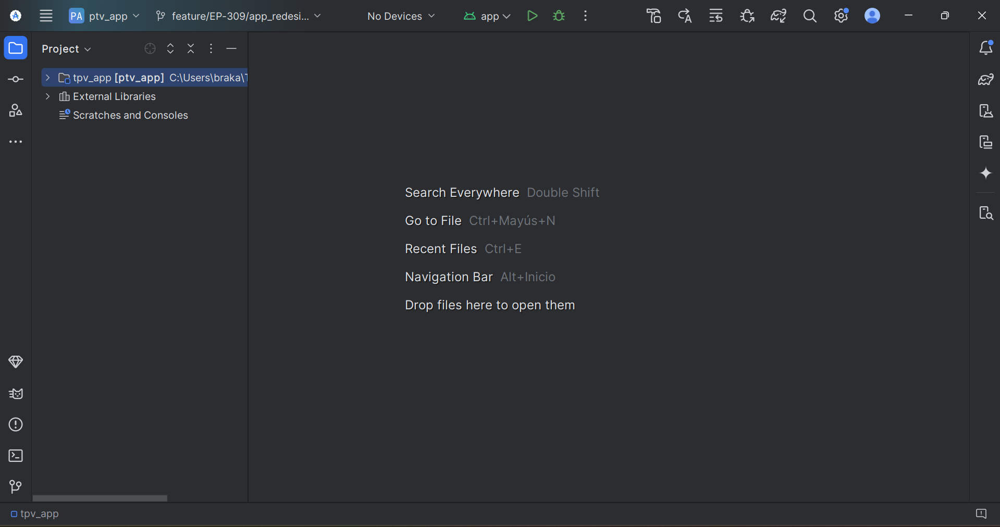
## Visualización de la aplicación.

Es necesario utilizar un emulador, un teléfono o una terminal para visualizar la aplicación.

*Un **emulador** es un software que simula el funcionamiento de un dispositivo físico en un entorno virtual.*
#### 1.- Visualización con un emulador.

El IDE incluye esta opción para la creación de un emulador. Para acceder a ella, es necesario ubicarse en el panel derecho del IDE y presionar el ícono de un teléfono, denominado **Device Manager**.

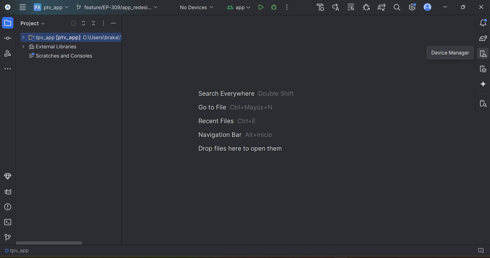

**Crear un nuevo dispositivo virtual**
- Dentro de **Device Manager**, presionar el botón con el ícono de más.
- Seleccionar **Create Virtual Device**.

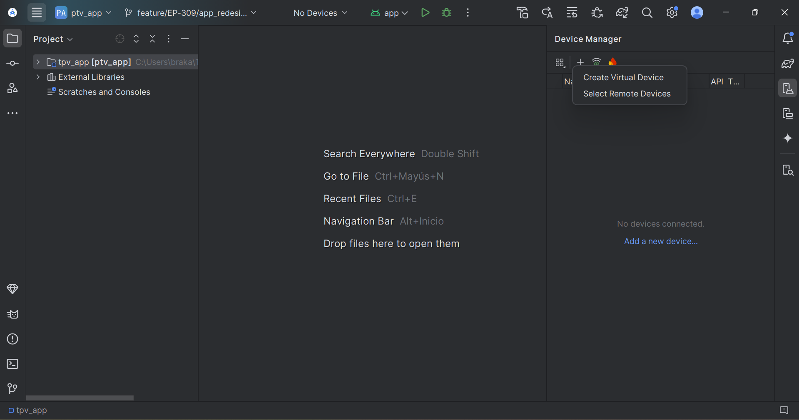

**Seleccionar el hardware del emulador**
- Elegir el tipo de dispositivo (teléfono, tableta, reloj, TV, etc.).
- Seleccionar el modelo y presionar **Next**.

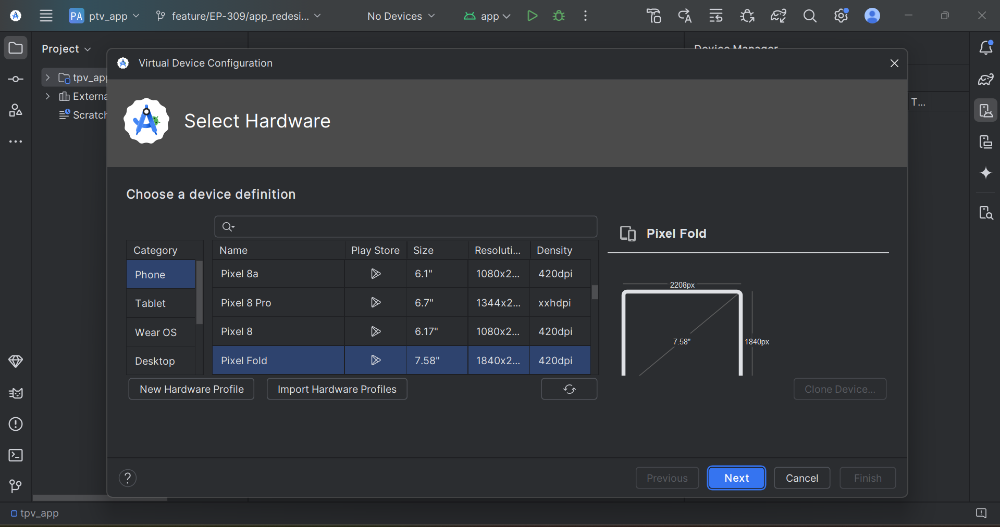

**Elegir la imagen del sistema operativo**
- Seleccionar la versión de Android que se desea emular.
- Descargar la imagen del sistema si no está disponible.
- Presionar **Next**.

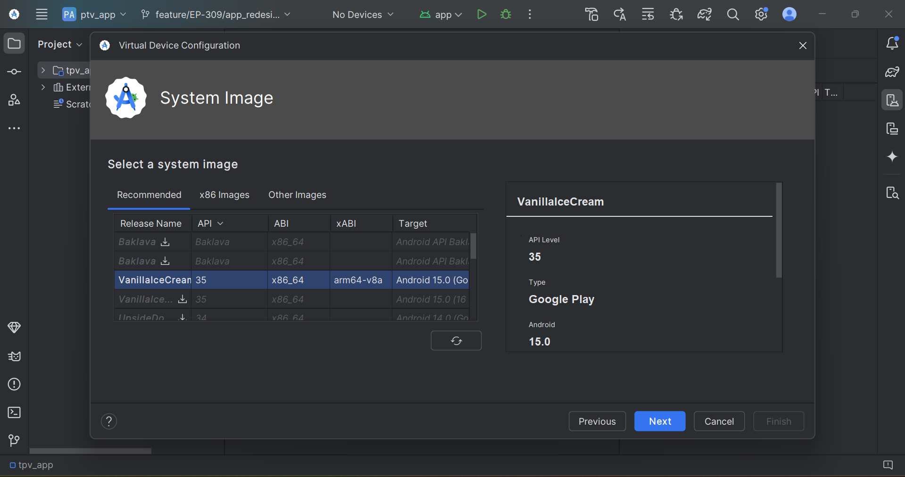

**Configurar el emulador**
- Ajustar las configuraciones del emulador, como el tamaño de pantalla, la cantidad de RAM y las opciones avanzadas si es necesario.
- Presionar **Finish** para guardar la configuración.

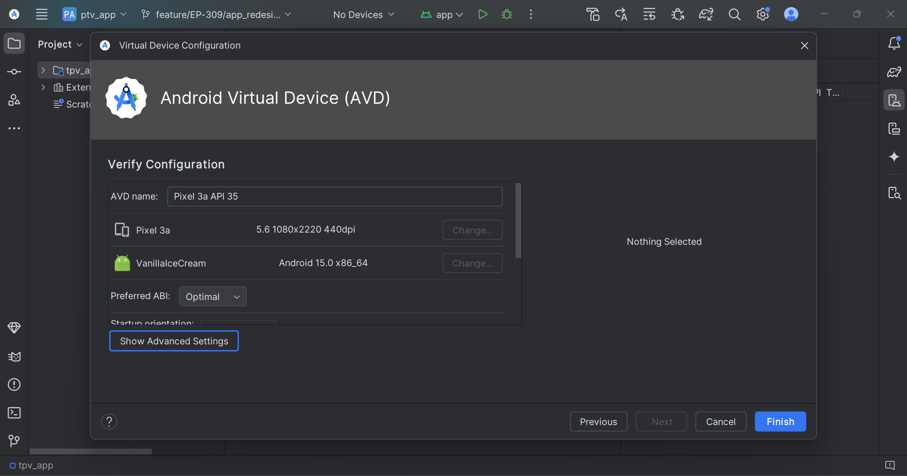

**Iniciar el emulador**
- En la lista de dispositivos virtuales, ubicar el emulador recién creado y presionar el botón **Start** con el icono de un play.

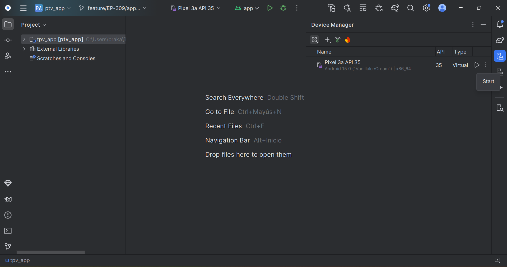

#### 2.- Visualización con una terminal o un teléfono Android.

La terminal y el teléfono Android tienen similitudes, en cuanto a su forma de conectarse, y poder ver la aplicación. 

La conexión de un teléfono Android puede variar según el dispositivo. Se recomienda acceder a **Configuración** > **Acerca del teléfono** y buscar la opción que permita activar el **modo desarrollador**.

Una vez activado el **modo desarrollador**, existen dos formas de habilitar la depuración: mediante **USB** o de forma **inalámbrica**.

###### 1.- Habilitar la depuración USB en el teléfono.

Una vez activado el modo desarrollador, se debe conectar el teléfono Android al ordenador mediante un cable USB y activar la opción **Depuración por USB**. El entorno de trabajo debería verse de la siguiente manera.

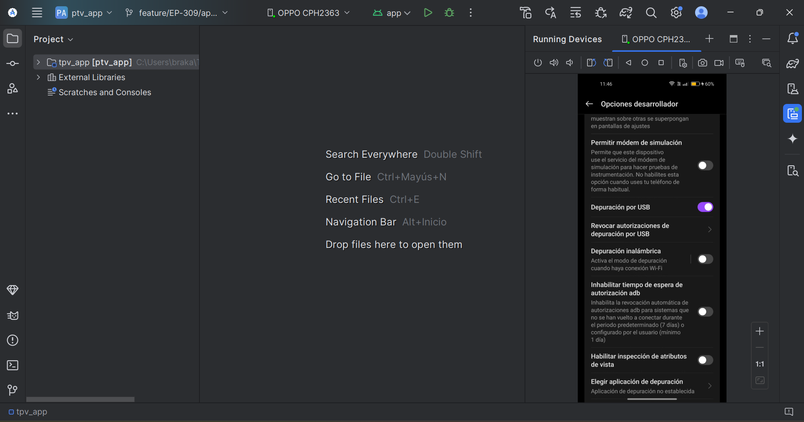

###### 2.- Habilitar la depuración por Conexión inalámbrica.

Debe activar la opción **Depuración inalámbrica**.

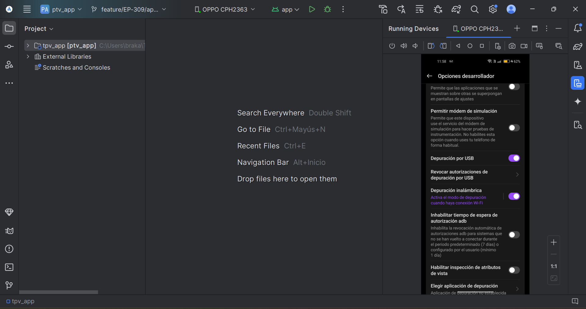

Acceda a esta opción y encontrará dos maneras de conectarse: una mediante un código QR o por un código de sincronización.
###### 2.1 Interfaz del IDE con sincronización mediante código QR

Dentro de las opciones de desarrollador, en el apartado de **Depuración inalámbrica**, podrá seleccionar la opción de **Vinculación mediante código QR**, se deberá escanear el código que aparece en el IDE.

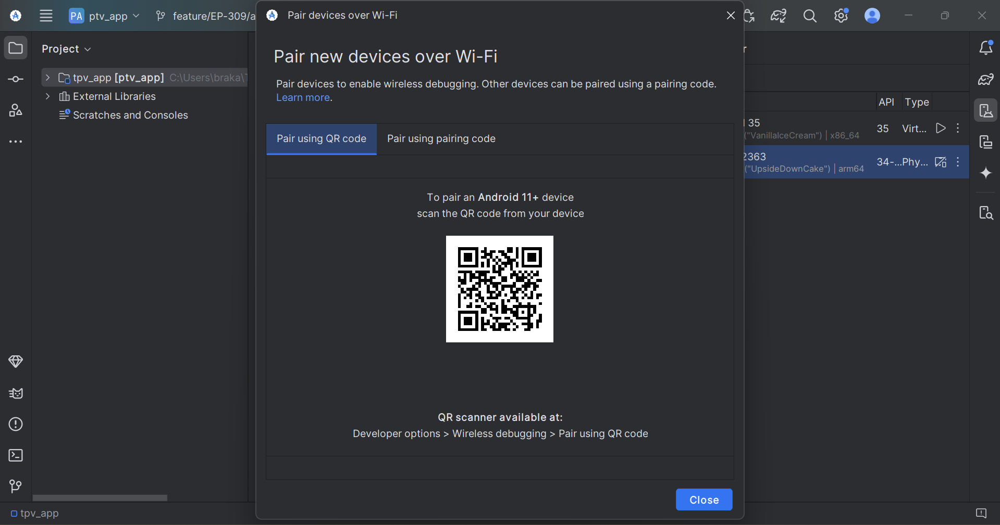

######  2.2 Interfaz del IDE con sincronización por código. 

Para realizar esta parte, el ordenador debe reconocer la dirección IP del teléfono Android o terminal. Presione el botón **Pair**, lo que abrirá una nueva ventana.

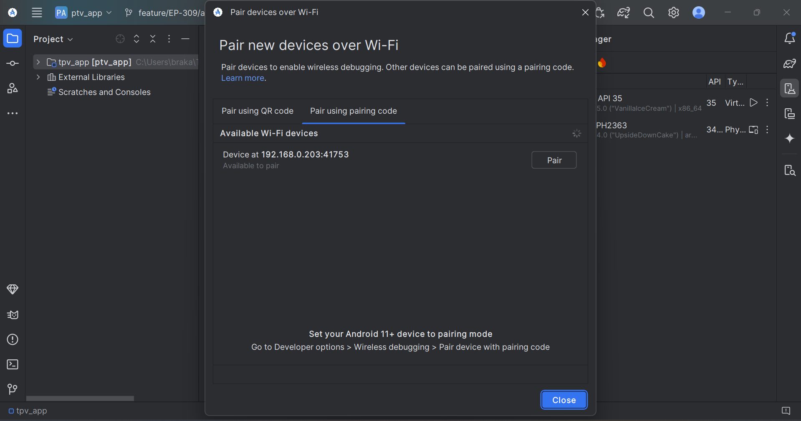

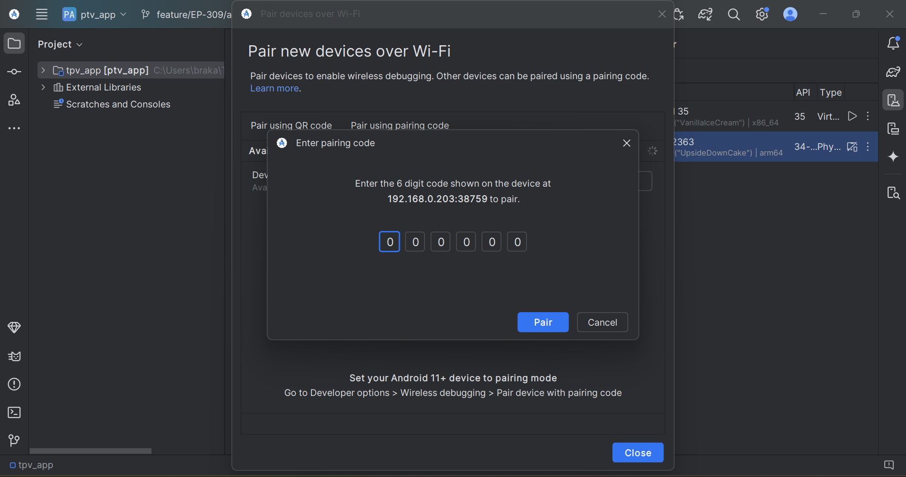

Para activar la sincronización en el teléfono Android o terminal, una vez que haya activado la opción **Emparejar dispositivo con código de sincronización**, el dispositivo emitirá una alerta como la siguiente. El código generado debe ser ingresado, lo que permitirá que el dispositivo se sincronice con el ordenador.

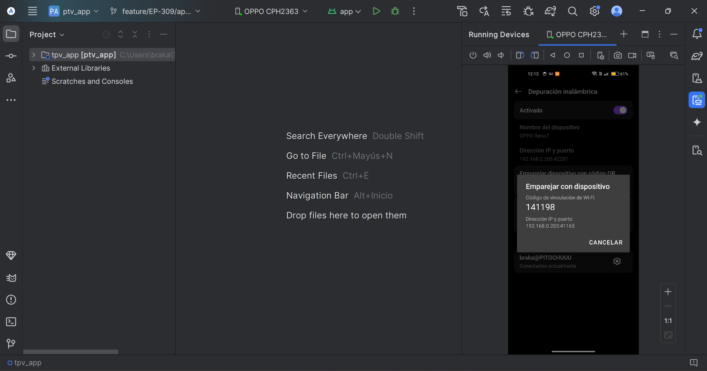

Ya sea que elija **Depuración por cable USB** o **Depuración inalámbrica**, con cualquiera de las dos formas de sincronización, debería poder permitirle visualizar la pantalla de su dispositivo, como se muestra en la imagen anterior.
## Ejecución de la aplicación.

Dentro del IDE, en la parte superior, encontrara un icono de play de color verde. Debe presionar este icono, para iniciar con la ejecución de la aplicación.

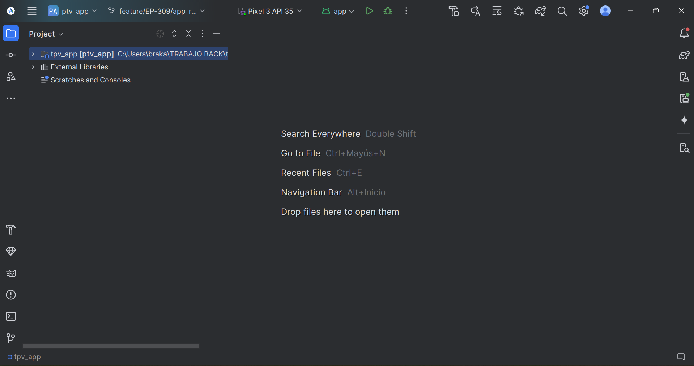

Al completarse la compilación sin errores, la aplicación se ejecutará correctamente. Si la ejecución es exitosa debe de verse de la siguiente manera.

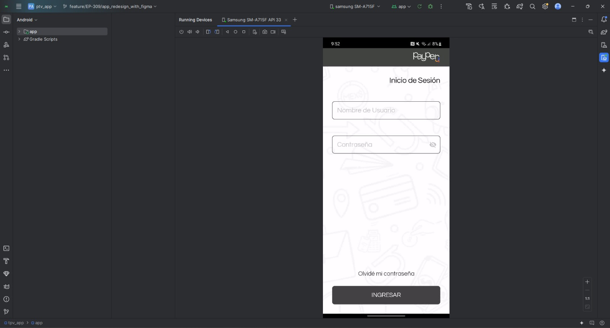
## Solución de errores de compilación. 

Si al ejecutar la aplicación se produce un error relacionado con la compilación de Gradle, se deben seguir estos pasos:

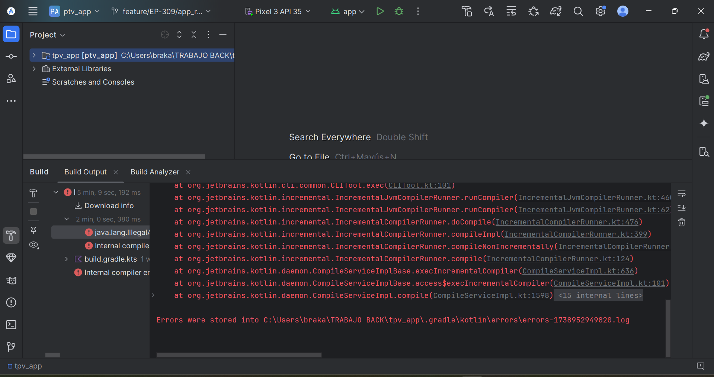

2. Cambiar a la rama **fix/kapt** en el repositorio `tpv_app`, donde se encuentran los archivos necesarios para solucionar el problema.

3. Copiar los siguientes archivos de la rama **fix/kapt** y remplazarlos en la rama **feature/EP-309/app_resending_with_figma**:

- `build.gradle.kts` (Project: `ptv_app`)
- `build.gradle.kts` (Module: `app`)
- `libs.versions.toml` (Version Catalog)

Para ubicar estos archivos con mayor rapidez, en la parte superior izquierda se encuentra el apartado **Project**, el cual despliega un menú. En la parte inferior del menú se debe seleccionar **Android**.

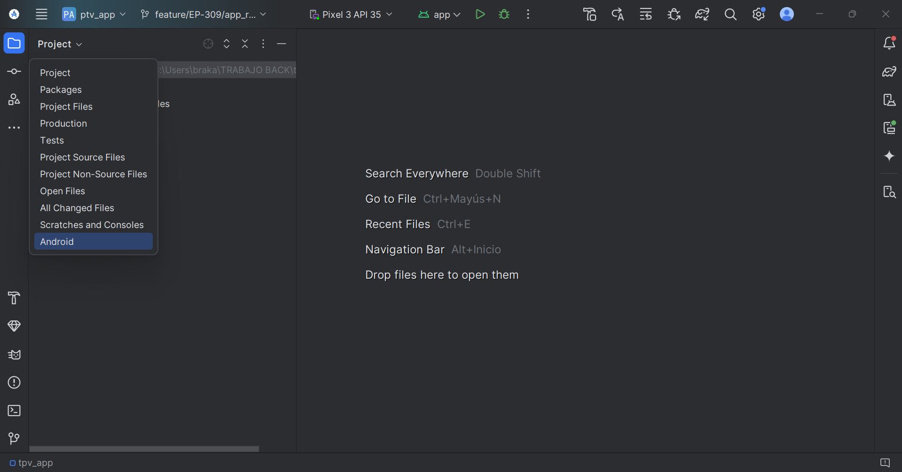

Su entorno de trabajo ahora debería verse así.

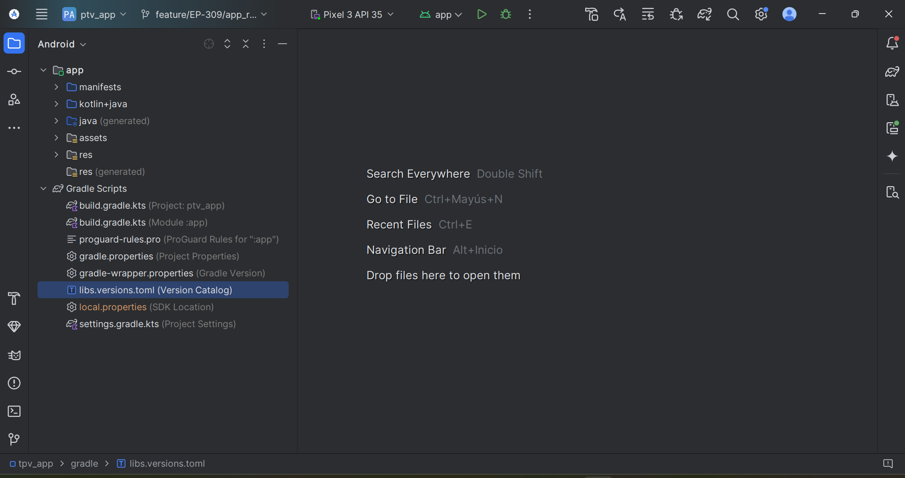

Una vez modificados, los archivos aparecerán con el nombre en color azul. De esta forma podrá verificar si fueron reemplazados. 

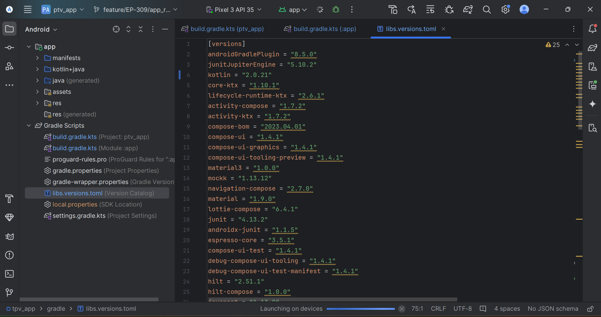

Finalmente, la interfaz de Android Studio deberá lucir como se muestra a continuación, indicando que la sincronización fue exitosa.

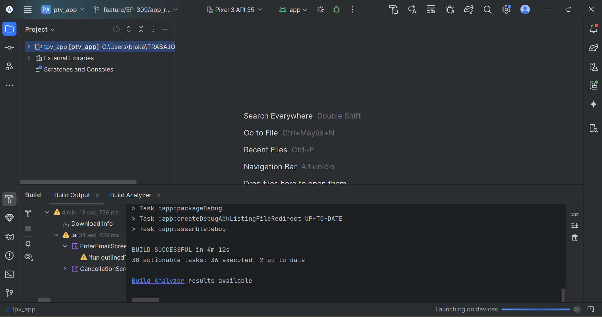
